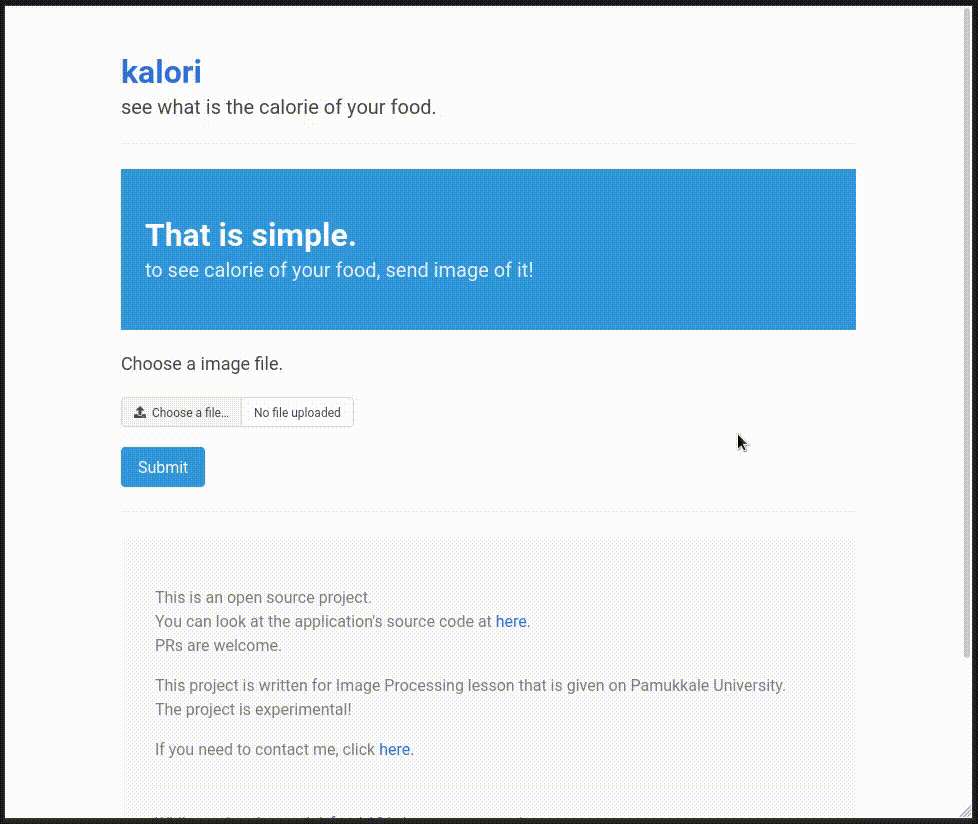

你好！
很冒昧用这样的方式来和你沟通，如有打扰请忽略我的提交哈。我是光年实验室（gnlab.com）的HR，在招Golang开发工程师，我们是一个技术型团队，技术氛围非常好。全职和兼职都可以，不过最好是全职，工作地点杭州。
我们公司是做流量增长的，Golang负责开发SAAS平台的应用，我们做的很多应用是全新的，工作非常有挑战也很有意思，是国内很多大厂的顾问。
如果有兴趣的话加我微信：13515810775  ，也可以访问 https://gnlab.com/，联系客服转发给HR。
# kalori

> This project is written for Image Processing lesson that is given on Pamukkale University.  
  The project is experimental!

An app that lets you see what the calories of your food.

## Features

- It can detect foods like; baklava, cheesecake, french fries, hamburger, hot dog, omelette, pizza, sushi, tiramisu, waffle, lentil soup, sarma, cigkofte...
- To train model, Food 101 dataset was used. [**(source)**](https://data.vision.ee.ethz.ch/cvl/datasets_extra/food-101/)
- Show the calories of the food. [**(source)**](https://fdc.nal.usda.gov/index.html)

## Technologies

- Go
- Google Vision AutoML

## Usage

